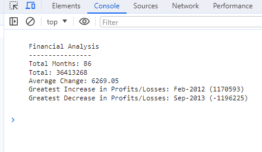
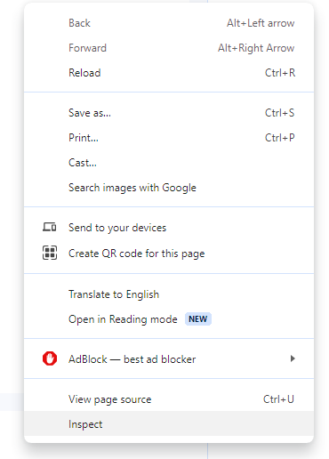

# Console Finances


<details>
  <summary>Table of Contents</summary>
  <ol>
    <li><a href="#Description">Description</a></li>
    <li><a href="#Screenshot">Screenshot</a></li>
    <li><a href="#Installation">Installation</a></li>
    <li><a href="#Usage">Usage</a></li>
    <li><a href="#Link">Link</a></li>
    <li><a href="#Credits">Credits</a></li>
    <li><a href="#License">License</a></li>
  </ol>
</details>


## Description

The purpose of this simple console application is to allow a user to have their data set processed and then visually presented to them. Using simple concepts such as loops and conditional loops I was able to work out different information from the raw array that I was given. Information such as Total Months, Total Profit/Loss, average profit/loss change from month to month as well as the greatest increase/decrease in profit/loss. I have then presented this information using the console.log function and backticks.


## Screenshot





## Installation


To install this project clone the repo
    ```
    git@github.com:Dominik-Jad/Console-Finances.git
    ```
    <br>
Open the files in VS Code and select 'Open With Live Server' on index.html. Right click anywhere on the page and press inspect element. Next, navigate to the console tab and the console application should be visible.





Any changes you make to the script will be automatically updated on the live server.


## Usage


This simple console application allows the user to input a set of data and have it presented to them in a more readable way. The user is able to see the average change of profit/loss over the entire period. The console application is scaleable and the user can add more data into the finaces array and the application will automatically calculate all of the imformation the user is looking for. Things like the total number of months, greatest increase and greatest decrease.


## Link


https://dominik-jad.github.io/Console-Finances/


## Credits
Loops and iteration - https://developer.mozilla.org/en-US/docs/Web/JavaScript/Guide/Loops_and_iteration

Formating a number to 2 decimal places - https://developer.mozilla.org/en-US/docs/Web/JavaScript/Reference/Global_Objects/Number/toFixed
## License


Please refer to the LICENSE in the repo.
